# Daily note
## 15/04/2024
### Microcontroller boards we need to support
[MSP432P401R LaunchPad from Texas Instruments](https://software-dl.ti.com/msp430/msp430_public_sw/mcu/msp430/SIMPLELINK_MSP432_SDK/1.20.00.45/exports/docs/simplelink_mcu_sdk/project0/project0/docs/MSP-EXP432P401R.html)

[MSP432E401Y LaunchPad from Texas Instruments](https://www.ti.com/tool/MSP-EXP432E401Y)

[TM4C129E LaunchPad from Texas Instruments](https://www.ti.com/tool/EK-TM4C129EXL)

[STM32F407G-DISC1 from STM](https://www.digikey.es/es/products/detail/stmicroelectronics/STM32F407G-DISC1/5824404)

[STM32L476RG Nucleo from STM](https://www.st.com/en/evaluation-tools/nucleo-l476rg.html)

### Microcontroller boards we'd like to support (optionally)
[CC3220SF LaunchPad from Texas Instruments](https://www.ti.com/tool/CC3220SF-LAUNCHXL)

[MSP430FR5994 LaunchPad from Texas Instruments](https://www.ti.com/tool/MSP-EXP430FR5994)

[ESP32-C6 DevKit from Expressif](https://www.mouser.es/ProductDetail/Espressif-Systems/ESP32-C6-DevKitC-1-N8?qs=8Wlm6%252BaMh8TjnOR8RwmaBw%3D%3D&mgh=1&vip=1&utm_id=19105062713&gad_source=1&gclid=CjwKCAjww_iwBhApEiwAuG6ccL-T_OCe5tMvoHe6_qJgbdB7G4ubsO1zwnKDqwUsUrsUlbqtqguAuRoCicEQAvD_BwE)

### Sensor/actuator boards we need to support
[BOOSTXL-EDUMKII from Texas Instruments](https://www.ti.com/tool/BOOSTXL-EDUMKII?DCMP=epd-mcu-lyd-tutorial-wwe&HQS=epd-mcu-lyd-tutorial-lydesign-20151008-tf-edbp-wwe)

### Sensor/actuator boards we'd like to support (optionally)

## 16/04/2024
Today we have three options available to us :

- The first would be to create a large main board and other small boards where the microcontroller boards would be placed on top of them, and the small boards would be placed on the large main board.
- The second option would be to install connectors and switches on the main board that would allow for adapting the inputs and outputs of the connectors according to the microcontroller boards.
- The third option would be to directly install many connectors on the main board for the various microcontroller boards.

For the second option : We need to check on each microcontroller boards their types of connections to see which ones are the same in order to use as few switchs as possible.

## 17/04/2024
### MSP432P401R LaunchPad Pinout

### MSP432E401Y LaunchPad Pinout

### TM4C129E LaunchPad Pinout

### STM32F407G-DISC1 Pinout

### STM32L476RG Nucleo Pinout
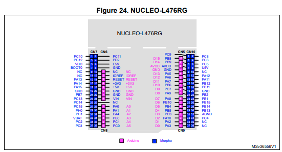
### BOOSTXL-EDUMKII Pinout
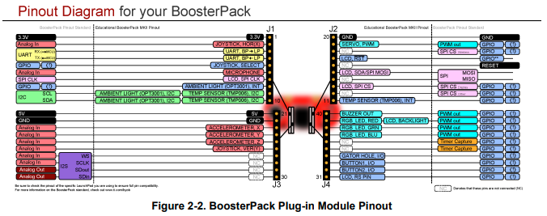

## 18/04/2024
### STM32 Nucleo Table
| Microcontroller Boards          |                    Pinout                    |                            Pin Change                            |
| :------------------------------ | :------------------------------------------: | :--------------------------------------------------------------- |
| **NUCLEO-L476RG**               | 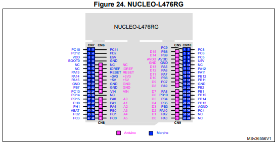               |                                                                  |
| NUCLEO-L452RE                   | 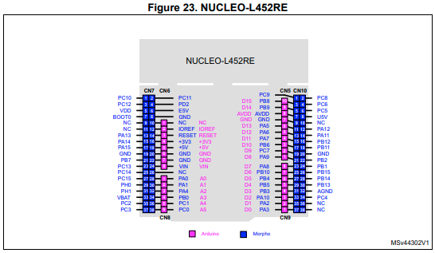               |                                                                  |
| NUCLEO-F030R8                   |                 | (9)NC -> PF6, (11)NC -> PF7, PH0 -> PF0, PH1 -> PF1, (36)NC -> PF5, (38)NC -> PF4 |
| NUCLEO-F070RB                   |                 | PH0 -> PF0, PH1 -> PF1, VBAT -> VDD                              |
| NUCLEO-F072RB                   |                 | PH0 -> PF0, PH1 -> PF1                                           |
| NUCLEO-F091RC                   | 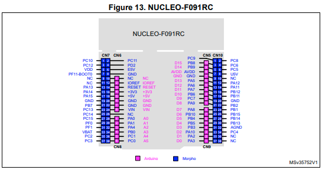                | BOOT0 -> PF0-BOOT0, PH0 -> PF0, PH1 -> PF1                       |
| NUCLEO-F103RB                   | 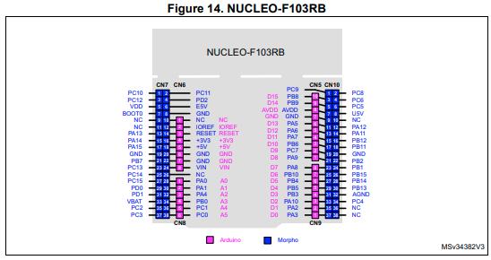                | PH0 -> PD0, PH1 -> PD1                                           |
| NUCLEO-F302R8                   | 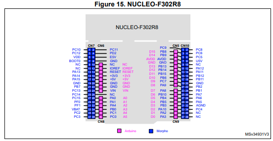                | PH0 -> PF0, PH1 -> PF1, PA5 <-> PB13, PA6 <-> PB14, PA7 <-> PB15 |
| NUCLEO-F303RE                   | 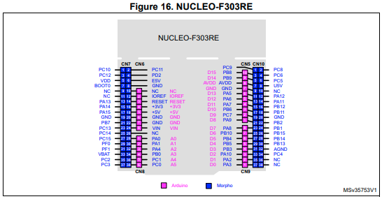                | PH0 -> PF0, PH1 -> PF1                                           |
| NUCLEO-F334R8                   | 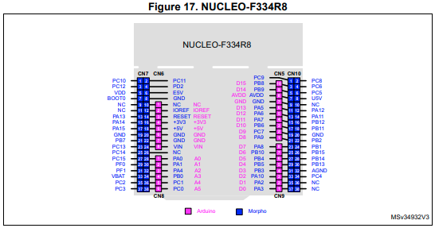               | PH0 -> PF0, PH1 -> PF1                                           |
| NUCLEO-F401RE                   | 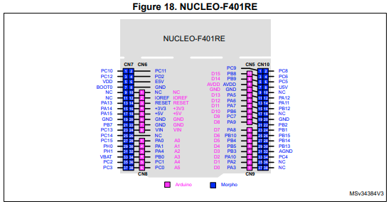               | PB11 -> NC                                                       |
| NUCLEO-F411RE                   | 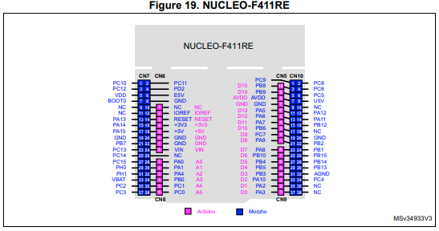               | PB11 -> NC                                                       |
| NUCLEO-L053R8                   | 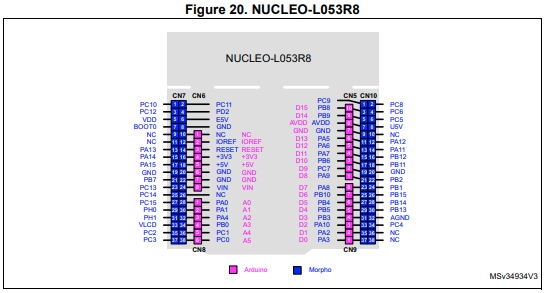               | VBAT -> VLCD                                                     |
| NUCLEO-L073RZ and NUCLEO-L010RB | 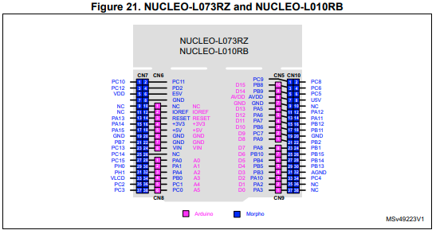 | ~~BOOT0~~, VBAT -> VLCD                                      |
| NUCLEO-L152RE                   | 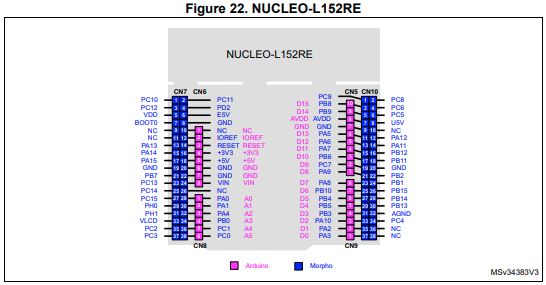               | VBAT -> VLCD                                                     |
| NUCLEO-F446RE                   | 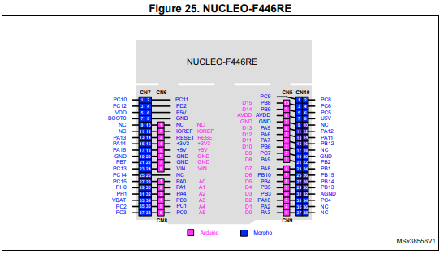               | PB11 -> NC                                                       |
| NUCLEO-F410RB                   | 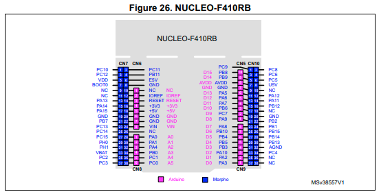               | PD2 -> PB11, PB11 -> NC                                          |

In conclusion, only one set of connectors will be needed for the Nucleo boards because there are few pin changes, which implies very few dip switches.

## 19/04/2024
### LaunchPad Pinout
For the MSP432P401R LaunchPad and MSP432E401Y LaunchPad, the pins are very similar, so there would be few changes to make.

_I discussed with my supervisor about what we should add on the extension board. We will need a separate UART from the ESP32 microcontroller, test points for the UART, the LEDs, etc., and implement a debounce system for the push buttons to prevent too many bounces._

## 23/04/2024
### Arrangement of the different sections of the extension board
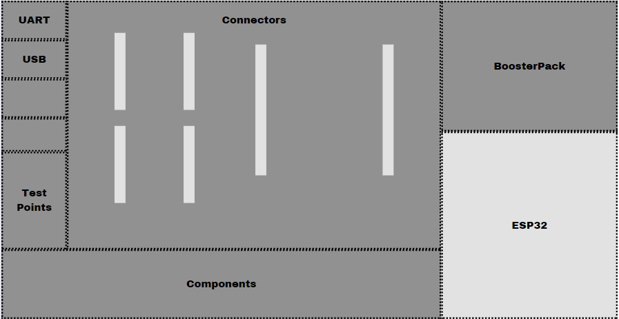
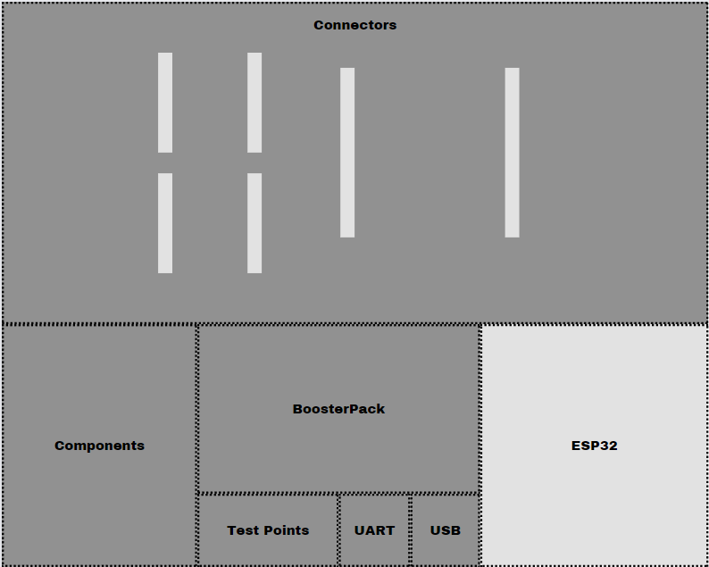
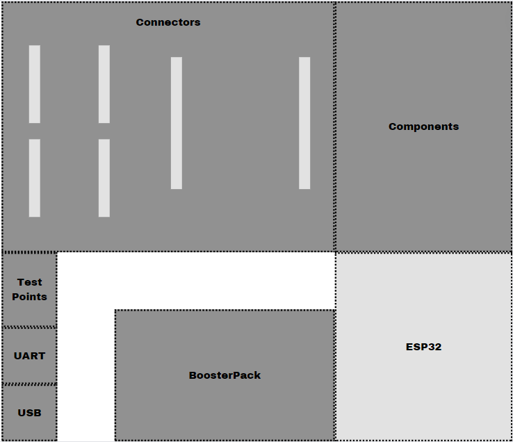

### Schematic
We have different sections for the extansion board that include :
- Connectors for the microcontrollers
- BoosterPack
- ESP32
- UART (USB?)
- Components (RGB LEDs, push buttons, 7-segments display, etc.)
- Test points to test the UART, the ESP32, the components, etc.
- Dip switches

#### BoosterPack
We have a problem with the schematic file :

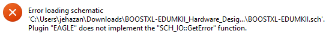

_I'll check with my supervisor tomorrow_

#### 7-segments display and UART
_I'll check with my supervisor what type of 7-segments display and UART we need_

## 24/04/2024
### Organization of the board
- Measure the gaps between each connector to match the positions of the microcontroller pins
- Knowing the dimensions of each element to properly arrange them on the board and avoid running out of space or taking too much space
- Knowing roughly the number of components to add (leaving dedicated space)

### Summary
Today I started the schematic of the extension board. I divided the schematic into different sections for optimal organization. Next time, I need to work on the parts that use dip switches. I also need to determine if we can use multiple UARTs from the microcontrollers, and I need to create a table to reference the different dimensions for the connector positions.

## 29/04/2024
To pick up where we left off, we don't need to use the schematic of the boosterpack; we just need to use connectors like the other microcontrollers. I still need to determine the type of 7-segment display to use. Also, we need to figure out how to route the UART outputs of the microcontrollers to our switch.