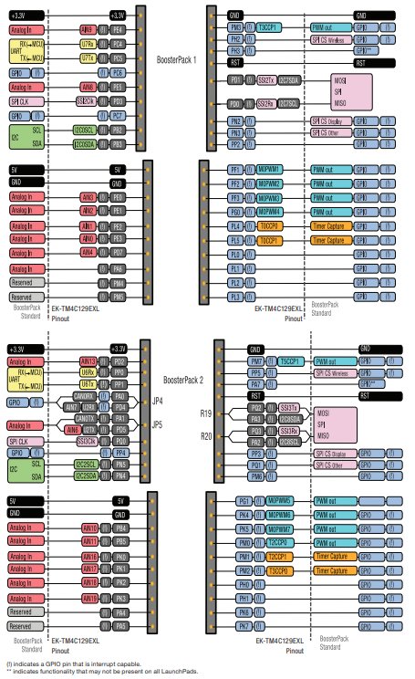
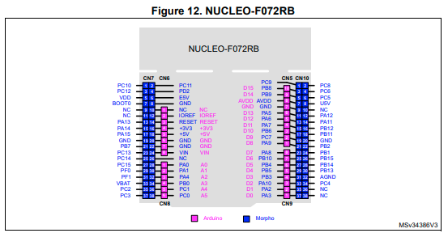
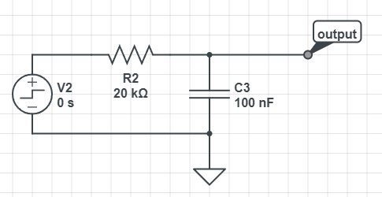
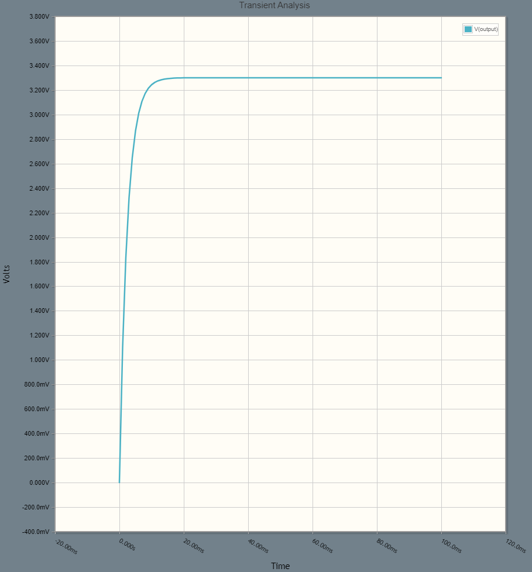
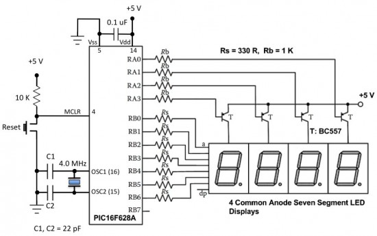
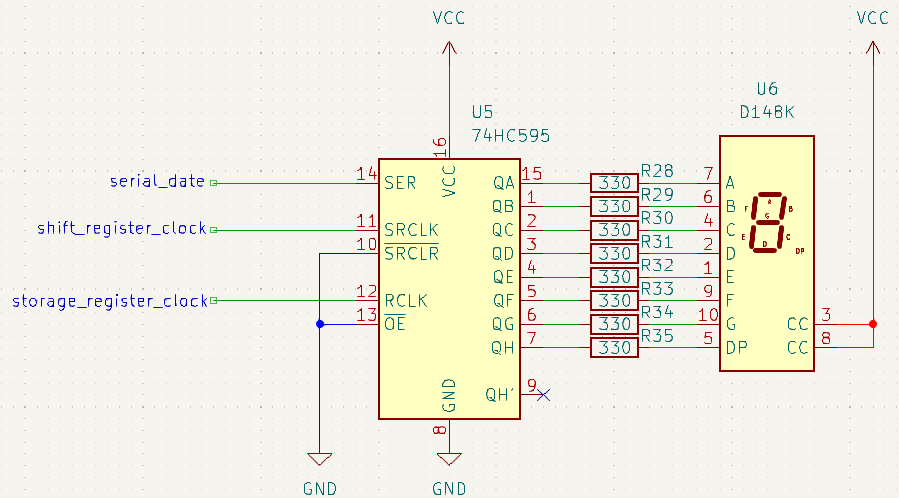
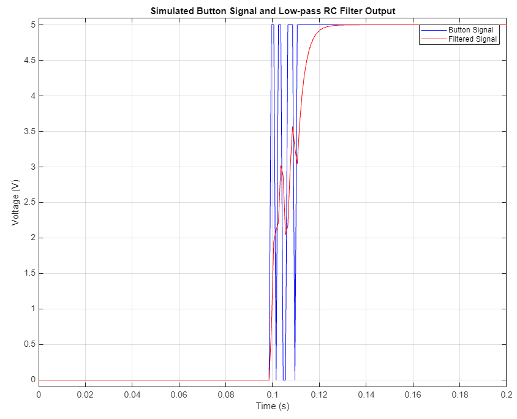
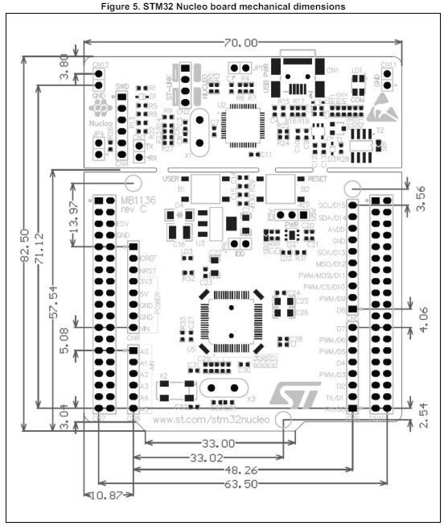
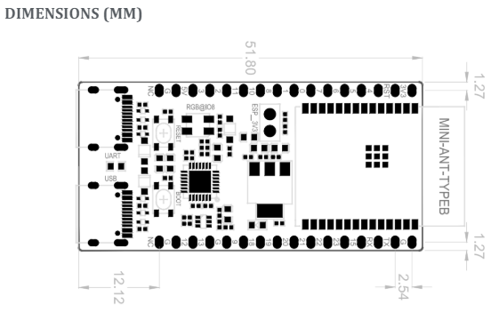
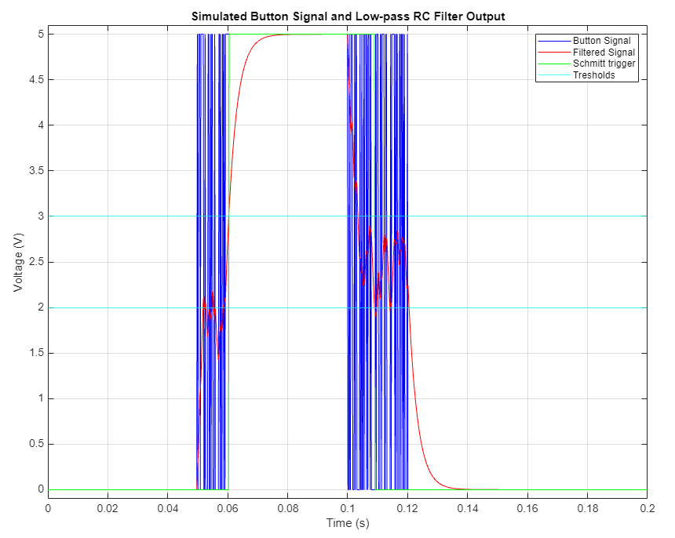

# Daily note
## 15/04/2024
### Microcontroller boards we need to support
[MSP432P401R LaunchPad from Texas Instruments](https://software-dl.ti.com/msp430/msp430_public_sw/mcu/msp430/SIMPLELINK_MSP432_SDK/1.20.00.45/exports/docs/simplelink_mcu_sdk/project0/project0/docs/MSP-EXP432P401R.html)

[MSP432E401Y LaunchPad from Texas Instruments](https://www.ti.com/tool/MSP-EXP432E401Y)

[TM4C129E LaunchPad from Texas Instruments](https://www.ti.com/tool/EK-TM4C129EXL)

[STM32F407G-DISC1 from STM](https://www.digikey.es/es/products/detail/stmicroelectronics/STM32F407G-DISC1/5824404)

[STM32L476RG Nucleo from STM](https://www.st.com/en/evaluation-tools/nucleo-l476rg.html)

### Microcontroller boards we'd like to support (optionally)
[CC3220SF LaunchPad from Texas Instruments](https://www.ti.com/tool/CC3220SF-LAUNCHXL)

[MSP430FR5994 LaunchPad from Texas Instruments](https://www.ti.com/tool/MSP-EXP430FR5994)

[ESP32-C6 DevKit from Expressif](https://www.mouser.es/ProductDetail/Espressif-Systems/ESP32-C6-DevKitC-1-N8?qs=8Wlm6%252BaMh8TjnOR8RwmaBw%3D%3D&mgh=1&vip=1&utm_id=19105062713&gad_source=1&gclid=CjwKCAjww_iwBhApEiwAuG6ccL-T_OCe5tMvoHe6_qJgbdB7G4ubsO1zwnKDqwUsUrsUlbqtqguAuRoCicEQAvD_BwE)

### Sensor/actuator boards we need to support
[BOOSTXL-EDUMKII from Texas Instruments](https://www.ti.com/tool/BOOSTXL-EDUMKII?DCMP=epd-mcu-lyd-tutorial-wwe&HQS=epd-mcu-lyd-tutorial-lydesign-20151008-tf-edbp-wwe)

### Sensor/actuator boards we'd like to support (optionally)

## 16/04/2024
Today we have three options available to us :

- The first would be to create a large main board and other small boards where the microcontroller boards would be placed on top of them, and the small boards would be placed on the large main board.
- The second option would be to install connectors and switches on the main board that would allow for adapting the inputs and outputs of the connectors according to the microcontroller boards.
- The third option would be to directly install many connectors on the main board for the various microcontroller boards.

For the second option : We need to check on each microcontroller boards their types of connections to see which ones are the same in order to use as few switchs as possible.

## 17/04/2024
### MSP432P401R LaunchPad Pinout

### MSP432E401Y LaunchPad Pinout

### TM4C129E LaunchPad Pinout

### STM32F407G-DISC1 Pinout

### STM32L476RG Nucleo Pinout

### BOOSTXL-EDUMKII Pinout

## 18/04/2024
### STM32 Nucleo Table
| Microcontroller Boards          |                    Pinout                    |                            Pin Change                            |
| :------------------------------ | :------------------------------------------: | :--------------------------------------------------------------- |
| **NUCLEO-L476RG**               |                |                                                                  |
| NUCLEO-L452RE                   |                |                                                                  |
| NUCLEO-F030R8                   |                 | (9)NC -> PF6, (11)NC -> PF7, PH0 -> PF0, PH1 -> PF1, (36)NC -> PF5, (38)NC -> PF4 |
| NUCLEO-F070RB                   |                 | PH0 -> PF0, PH1 -> PF1, VBAT -> VDD                              |
| NUCLEO-F072RB                   |                 | PH0 -> PF0, PH1 -> PF1                                           |
| NUCLEO-F091RC                   |                 | BOOT0 -> PF0-BOOT0, PH0 -> PF0, PH1 -> PF1                       |
| NUCLEO-F103RB                   |                 | PH0 -> PD0, PH1 -> PD1                                           |
| NUCLEO-F302R8                   |                 | PH0 -> PF0, PH1 -> PF1, PA5 <-> PB13, PA6 <-> PB14, PA7 <-> PB15 |
| NUCLEO-F303RE                   |                 | PH0 -> PF0, PH1 -> PF1                                           |
| NUCLEO-F334R8                   |                | PH0 -> PF0, PH1 -> PF1                                           |
| NUCLEO-F401RE                   |                | PB11 -> NC                                                       |
| NUCLEO-F411RE                   |                | PB11 -> NC                                                       |
| NUCLEO-L053R8                   |                | VBAT -> VLCD                                                     |
| NUCLEO-L073RZ and NUCLEO-L010RB |  | ~~BOOT0~~, VBAT -> VLCD                                      |
| NUCLEO-L152RE                   |                | VBAT -> VLCD                                                     |
| NUCLEO-F446RE                   |                | PB11 -> NC                                                       |
| NUCLEO-F410RB                   |                | PD2 -> PB11, PB11 -> NC                                          |

In conclusion, only one set of connectors will be needed for the Nucleo boards because there are few pin changes, which implies very few dip switches.

## 19/04/2024
### LaunchPad Pinout
For the MSP432P401R LaunchPad and MSP432E401Y LaunchPad, the pins are very similar, so there would be few changes to make.

_I discussed with my supervisor about what we should add on the extension board. We will need a separate UART from the ESP32 microcontroller, test points for the UART, the LEDs, etc., and implement a debounce system for the push buttons to prevent too many bounces._

## 23/04/2024
### Arrangement of the different sections of the extension board

### Schematic
We have different sections for the extansion board that include :
- Connectors for the microcontrollers
- BoosterPack
- ESP32
- UART (USB?)
- Components (RGB LEDs, push buttons, 7-segments display, etc.)
- Test points to test the UART, the ESP32, the components, etc.
- Dip switches

#### BoosterPack
We have a problem with the schematic file :

_I'll check with my supervisor tomorrow_

#### 7-segments display and UART
_I'll check with my supervisor what type of 7-segments display and UART we need_

## 24/04/2024
### Organization of the board
- Measure the gaps between each connector to match the positions of the microcontroller pins
- Knowing the dimensions of each element to properly arrange them on the board and avoid running out of space or taking too much space
- Knowing roughly the number of components to add (leaving dedicated space)

### Summary
Today I started the schematic of the extension board. I divided the schematic into different sections for optimal organization. Next time, I need to work on the parts that use dip switches. I also need to determine if we can use multiple UARTs from the microcontrollers, and I need to create a table to reference the different dimensions for the connector positions.

## 29/04/2024
To pick up where we left off, we don't need to use the schematic of the boosterpack; we just need to use connectors like the other microcontrollers. I still need to determine the type of 7-segment display to use. Also, we need to figure out how to route the UART outputs of the microcontrollers to our switch.

_Tomorrow, I need to ask my supervisor if the component chosen for the temperature sensor is suitable. I also need to discuss with him about the UARTs of the Launchpads._

## 30/04/2024
### Summary
I discussed with my supervisor that I needed to create the LM335 component myself on KiCad. I also need to conduct a simulation on PSpice for the debounce circuit to determine the values of the resistor and capacitor.

We discussed an issue encountered with the STM32F407G-DISC1, where additional connectors were required for its connection. However, this would occupy space and increase the cost of the extension board. Therefore, we decided to remove this microcontroller.

Also, we talked about the 7-segment display and we agreed to use the HDSP-521E.

Lastly, we need several pins connected to the microcontrollers to connect external components (Analog In, Timer, etc.).

### Debouncing Circuit Simulation

In conclusion, we will have the following values for the resistor: 20 kohm and for the capacitor: 0.1 uF

_Tomorrow I need to finish the 7-segment display symbol_

## 02/05/2024
Today, I created the symbol for the 7-segment display. My supervisor sent me an email explaining that I need to multiplex to reduce the number of MCU pins required to drive the 7-segment displays. I started looking into the matter and will address it tomorrow.

## 03/05/2024
The multiplexing my supervisor asked me to implement consists of replicating something similar to the following schematic :

The drawback with this method is that it includes a PIC16F628A, which requires programming and in the long run may not be the most optimal solution in my opinion. I believe it would be better to use an 8-bit shift register (serial to parallel) such as the 74HC595 because it allows for easy addition of outputs to the microcontroller.

Here is an example circuit with the 74HC595 and a single-digit 7-segment display, you just need to adapt it with our two-digit 7-segment display :

## 07/05/2024
Today, I started the connections for the Analog In, SPI, and I2C of the launchpads and nucleos. I found connections for two different UARTs for the Nucleos, one for the ESP32 and one for the test points.
I had to modify the connections for pin changes and switches because I didn't have the correct number of pins for the nucleos; now the issue is fixed.

## 08/05/2024
Today I discussed the project progress with my supervisor. For the 7-segment display, I need to stick to the schematic my supervisor sent me. I looked into another model of 7-segment display to use : HS-3461B, which will be much more suitable for the desired setup.

I edited the symbol for the HS-3461B on KiCad because it wasn't in the global library and there was no design file available on the internet; we'll need to address the footprint issue. 

Regarding the debounce circuit, he asked me to redo the simulation to clearly see the button bounce. 

I am gradually progressing with the pin connections of the different microcontrollers.

On the other hand, the setup I had created for the 7-segment display could be used for the LED bar graph board.

## 13/05/2024
### Questions to ask my supervisor :
- Can I connect the microcontroller pins to multiple connectors?
- Should I separate the connectors for the SPI, I2C, and UART pins of the MSP432E401Y microcontroller that are not present on the other microcontrollers?
- Should I reserve the pins for the 7-segment display?
- What should I do with the ESP32-C6 DevKit microcontroller?
- Which pins should be connected to the test points?
- Where should the push buttons be connected?

## 15/05/2024
### Dimensions
#### Nucleos

#### MSP432P401R, MSP432E401Y, TM4C129E LaunchPads

#### ESP32-C6 DevKit

### Schmitt Trigger Buffer Simulation
